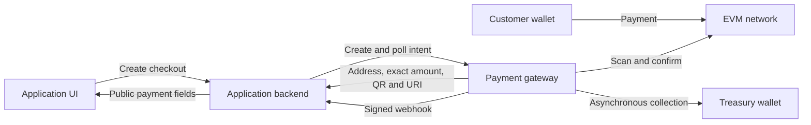
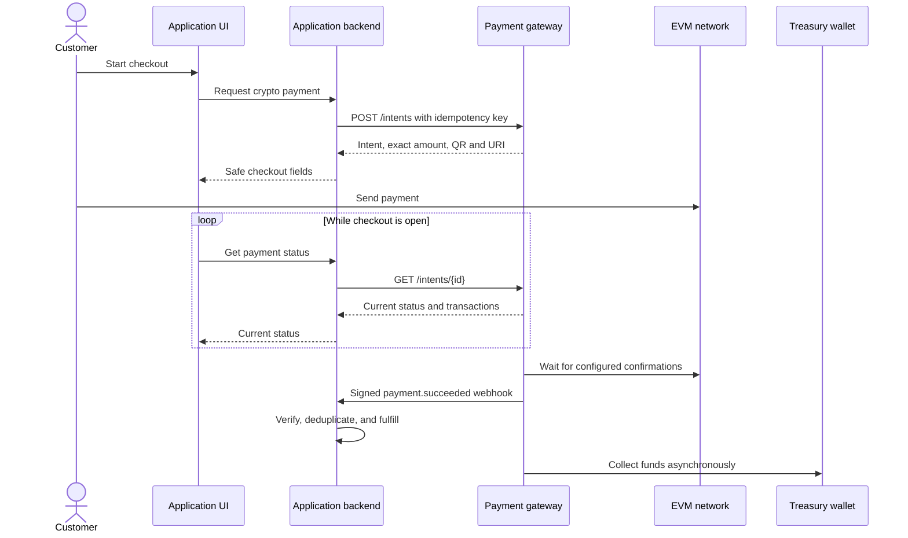
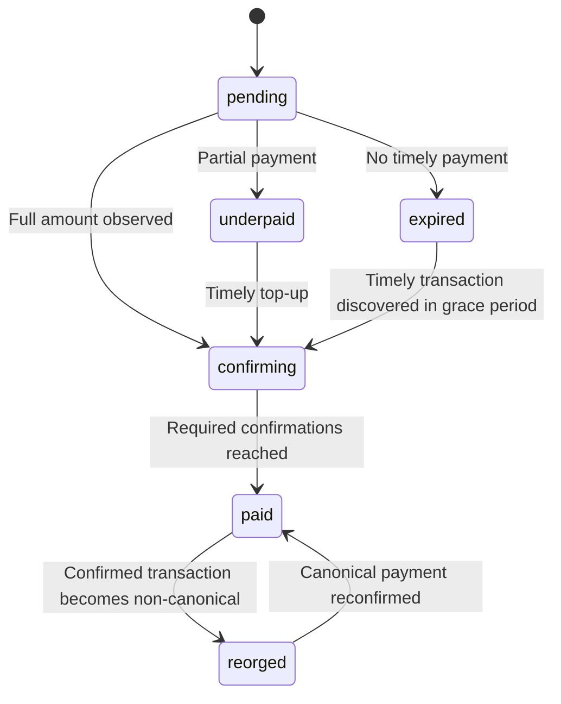
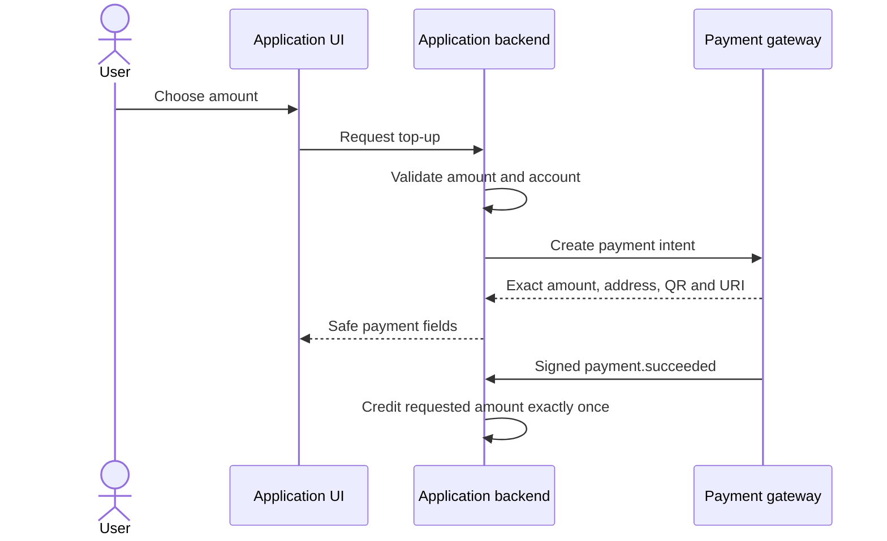

# Application integration guide

Integrate the gateway from your application backend. Never expose
`PAYMENT_API_KEY` or `PAYMENT_WEBHOOK_SECRET` to a browser or mobile client.

## Integration model



Your application remains the system of record for orders and entitlements. The
gateway detects payments and collects funds. It does not fulfill orders or
grant entitlements.

All payment endpoints use the `/api/payments/v1` prefix and require
`Authorization: Bearer <PAYMENT_API_KEY>`. Only `GET /health` is public.

| Method | Path | Purpose |
| --- | --- | --- |
| `POST` | `/intents` | Create or idempotently replay a payment intent. |
| `GET` | `/intents/{id}` | Poll status and the included transaction history. |
| `GET` | `/intents/{id}/transactions` | Read payment transactions only. |
| `GET` | `/intents/{id}/sweep` | Inspect treasury collection progress. |
| `GET` | `/analytics/summary` | Read aggregate payment and collection metrics. |

Errors use `{ "error": "message" }`. The API does not support lookup by
`externalId`.

Store every returned intent ID in your application database.

## 1. Create an intent from your backend

Price the product on your server. Use decimal strings for money. Do not
calculate the requested amount with a JavaScript floating-point number.

```ts
const gatewayUrl = process.env.GATEWAY_URL!;
const gatewayApiKey = process.env.GATEWAY_API_KEY!;

export async function createCryptoCheckout(order: {
  id: string;
  paymentAttemptId: string;
  accountId: string;
  amount: string;
}) {
  const response = await fetch(`${gatewayUrl}/api/payments/v1/intents`, {
    method: "POST",
    headers: {
      Authorization: `Bearer ${gatewayApiKey}`,
      "Content-Type": "application/json",
      "Idempotency-Key": `payment:${order.paymentAttemptId}`,
    },
    body: JSON.stringify({
      kind: "payment",
      externalId: order.id,
      chain: "base",
      asset: "USDC",
      amount: order.amount,
      expiresInSeconds: 1800,
      metadata: { accountId: order.accountId },
    }),
  });

  if (!response.ok) throw new Error(`Gateway returned ${response.status}`);
  return response.json();
}
```

Use one stable `Idempotency-Key` for all retries of the same checkout. The first
request returns `201`. An identical replay returns `200`. A replay with the same
key and a different body returns `409`.

The request body limit is 64 KiB. `metadata` must be a JSON object with no more
than 32 nested levels.

Keep `metadata` small. Store sensitive application data in your own database.

Use `payment` for a one-time charge and `invoice` for a payable invoice. The
gateway processes both types identically. Your application defines the product
or service.

The response includes the fields needed by your checkout:

```json
{
  "id": "pi_example",
  "kind": "payment",
  "externalId": "order_123",
  "chain": "base",
  "chainId": 8453,
  "asset": "USDC",
  "expectedAmount": "10.25",
  "expectedUnits": "10250000",
  "receivedAmount": "0",
  "confirmedAmount": "0",
  "remainingAmount": "10.25",
  "remainingUnits": "10250000",
  "depositAddress": "0x...",
  "paymentUri": "ethereum:0xToken@8453/transfer?address=0xDeposit&uint256=10250000",
  "qrCodeDataUrl": "data:image/svg+xml;base64,...",
  "topUpPaymentUri": "ethereum:0xToken@8453/transfer?address=0xDeposit&uint256=10250000",
  "topUpQrCodeDataUrl": "data:image/svg+xml;base64,...",
  "requiredConfirmations": 3,
  "status": "pending",
  "expiresAt": "2026-08-14T20:30:00.000Z",
  "expired": false,
  "metadata": { "accountId": "account_123" },
  "transactions": []
}
```

Before you return checkout data, store the gateway intent ID on your order.
Return only display fields such as `id`, `chain`, `chainId`, `asset`,
`expectedAmount`, `remainingAmount`, `depositAddress`, `topUpPaymentUri`,
`topUpQrCodeDataUrl`, `status`, and `expiresAt`.

## 2. Present and monitor the payment

Show `topUpQrCodeDataUrl` as an image. Use `topUpPaymentUri` as the wallet link.
Initially, these fields equal the original `qrCodeDataUrl` and `paymentUri`.
After a partial payment, they encode only `remainingUnits`. Thus, a second scan
does not send the original full amount again.

Show the chain, asset, `remainingAmount`, and deposit address as copyable text.
The customer can compare these values with the wallet transaction.

Poll from your backend. Alternatively, expose a narrow application endpoint
that proxies the safe status fields. Do not call the gateway directly from
browser code. All intent reads require the bearer API key.

```http
GET /api/payments/v1/intents/pi_example
Authorization: Bearer <gateway-api-key>
```

Poll every 5–10 seconds while the checkout page is open. Stop at a terminal
state. Use webhooks for authoritative fulfillment.

Use the separate `expired` boolean to close the payment UI. An underpaid intent
can keep the `underpaid` status after expiry. This status describes the funds
already seen.

If `expired` is true, do not show a top-up option. The gateway sets both top-up
fields to `null` when it cannot accept another payment. The original payment
fields remain unchanged for transaction traceability.



### Payment statuses



| Status | Application behavior |
| --- | --- |
| `pending` | Wait for a transaction. |
| `underpaid` | Show the remaining amount. Do not fulfill. |
| `confirming` | Show confirmation progress. Do not fulfill yet. |
| `paid` | After webhook validation, fulfill exactly once. |
| `expired` | Close checkout and create a new intent for another attempt. |
| `reorged` | Mark the payment for review or reverse reversible fulfillment. |

A transaction mined after the configured expiry grace period does not make the
intent paid. The gateway can still collect recoverable funds. Send this case to
support. Do not fulfill solely because funds appear in transaction or
collection history.

An overpayment still represents the one server-priced order identified by
`externalId`. Do not use `receivedUnits` to calculate additional product.
Handle excess funds through your support or refund policy.

### User-chosen payments

For donations, stored-value deposits, or account top-ups, let the user choose
an amount in your UI. Validate the permitted range, chain, and asset on your
backend. Create the same generic `payment` intent. Describe the application
purpose in metadata.

A separate intent kind is not necessary because settlement behavior is
identical.



```json
{
  "kind": "payment",
  "externalId": "topup_attempt_123",
  "chain": "base",
  "asset": "USDC",
  "amount": "25",
  "metadata": {
    "purpose": "account_top_up",
    "accountId": "account_123"
  }
}
```

Create a new intent for every attempt. After `payment.succeeded`, credit the
validated requested amount once with your ledger constraint. Do not convert an
accidental overpayment into additional balance.

## 3. Validate and process webhooks

The gateway sends `payment.succeeded`, `payment.reorged`, and informational
`payment.recovered` events. It retries non-2xx responses with exponential
backoff and keeps the same `Webhook-Id` and body. Each delivery includes:

```text
Webhook-Id: evt_...
Webhook-Timestamp: 1786737600
Webhook-Signature: v1,<hex-hmac-sha256>
```

Before you parse JSON, validate the signature against the raw request bytes.
Reject stale timestamps. Add `Webhook-Id` to a table with a unique
constraint inside the fulfillment database transaction.

```ts
import { createHmac, timingSafeEqual } from "node:crypto";

export function verifyGatewayWebhook(
  rawBody: Buffer,
  headers: Headers,
  secret: string,
): boolean {
  const timestamp = headers.get("Webhook-Timestamp") ?? "";
  const signature = headers.get("Webhook-Signature") ?? "";
  const supplied = signature.startsWith("v1,") ? signature.slice(3) : "";
  const seconds = Number(timestamp);

  if (!Number.isSafeInteger(seconds) || Math.abs(Date.now() / 1000 - seconds) > 300) return false;
  if (!/^[0-9a-f]{64}$/.test(supplied)) return false;

  const hmac = createHmac("sha256", secret);
  hmac.update(`${timestamp}.`);
  hmac.update(rawBody);
  const expected = hmac.digest();
  return timingSafeEqual(expected, Buffer.from(supplied, "hex"));
}
```

Example event:

```json
{
  "id": "evt_example",
  "type": "payment.succeeded",
  "createdAt": "2026-08-14T20:05:00.000Z",
  "data": {
    "paymentIntent": {
      "id": "pi_example",
      "externalId": "order_123",
      "kind": "payment",
      "chain": "base",
      "chainId": 8453,
      "asset": "USDC",
      "expectedAmount": "10.25",
      "receivedUnits": "10250000",
      "confirmedUnits": "10250000",
      "depositAddress": "0x...",
      "status": "paid",
      "transactionHashes": ["0x..."]
    }
  }
}
```

For `payment.succeeded`, match both `externalId` and the stored intent ID. Then
write a unique fulfillment ledger entry for your business order or invoice ID.
Keep the gateway intent ID on that entry.

This constraint prevents duplicate fulfillment from webhooks, polling, new
checkout attempts, or payment recovery after a reorg. After the transaction
commits, return a 2xx response.

For `payment.reorged`, record the incident. If your product supports safe
reversal, reverse the entitlement. If fulfillment is irreversible, configure
more confirmations for that network. For irreversible fulfillment, route the
reorg to manual review.

Model reversible fulfillment as a state transition on the existing business
order or invoice. If the same intent becomes paid again after a reorg, reactivate
that entitlement. For the same recovered intent, do not append a second grant.

`payment.recovered` means the gateway collected some or all funds from an
expired or underpaid intent. It includes `requestedUnits`, `receivedUnits`,
`missingUnits`, `collectedUnits`, and `collectedDeltaUnits`. It does not change
the intent to `paid`.

Use this event for support, refunds, or manual account-credit workflows. Do not
fulfill the original order automatically. Deduplicate each event because later
deposits can produce another recovery.

## 4. Reconcile missed events

Webhooks are at-least-once notifications.

Run a small reconciliation job for open orders. Poll the stored intent IDs.
Apply the same idempotent fulfillment function that the webhook handler uses.

```http
GET /api/payments/v1/intents/{id}
GET /api/payments/v1/intents/{id}/transactions
GET /api/payments/v1/intents/{id}/sweep
```

The transactions endpoint explains underpayments, confirmation counts, late
payments, and non-canonical transactions. The collection endpoint retains the
`/sweep` route name and is operational history only. Fulfill a `paid` intent
independently of treasury collection.

The authenticated analytics endpoint returns base-unit strings rather than
floating-point totals:

```http
GET /api/payments/v1/analytics/summary
```

It groups requested, received, confirmed, and collected units by chain and
asset, plus collection fees and webhook counts. Use your configured token
decimals to convert units only at the display boundary.

## Recurring billing

For any recurring product, create a new `invoice` intent for every billing
period. Use a new external ID and idempotency key for each period. After its own
`payment.succeeded` event, fulfill the invoice.

The gateway never stores an allowance or withdraws from the customer's wallet
automatically.

## Production checklist

Before production, complete these tasks:

- Keep both gateway secrets in the application backend only.
- Calculate product price, chain, and asset on the server.
- Before you show checkout, store the intent ID and `externalId` together.
- Treat all monetary values as decimal strings or integer base units.
- Validate signatures from raw bytes.
- Reject timestamps older than five minutes.
- Deduplicate webhook IDs and fulfilled business order or invoice IDs with
  database constraints.
- Use polling for display and recovery.
- Use a validated gateway status for fulfillment.
- Handle `payment.reorged` according to the reversibility of your product.
- Route `payment.recovered` to reconciliation.
- Never treat `payment.recovered` as payment success.
- Never make fulfillment depend on asynchronous treasury collection.
