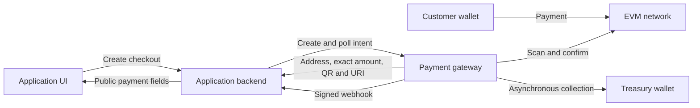
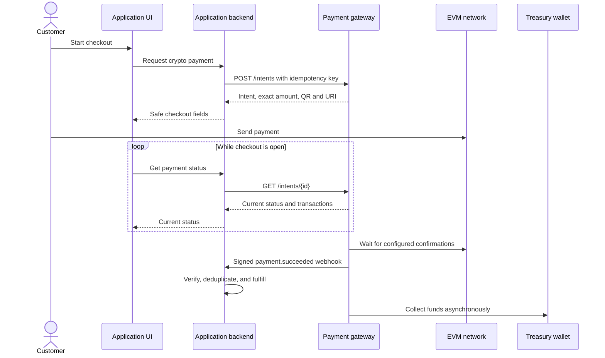
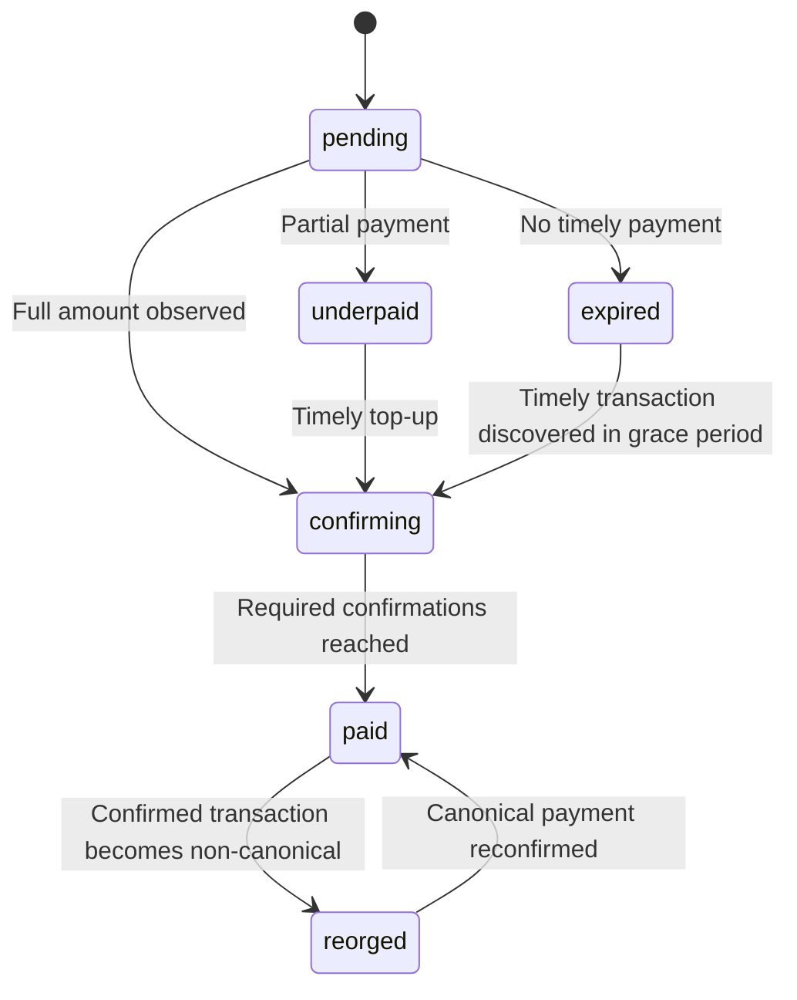
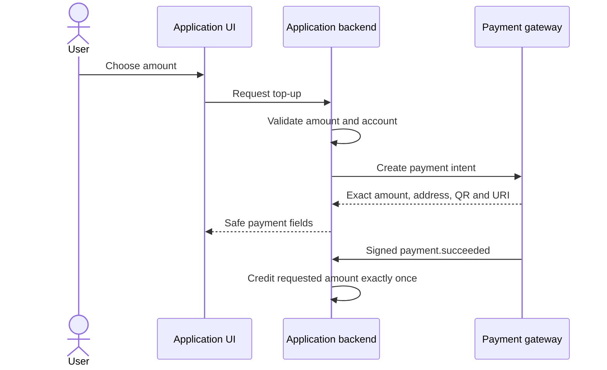

# Application integration guide

Integrate the gateway from your application backend. Never expose
`PAYMENT_API_KEY` or `PAYMENT_WEBHOOK_SECRET` to a browser or mobile client.

## Integration model



Your application remains the system of record for orders and entitlements. The
gateway detects payments and collects funds; it never fulfills the thing being
sold.

All payment endpoints use the `/api/payments/v1` prefix and require
`Authorization: Bearer <PAYMENT_API_KEY>`. Only `GET /health` is public.

| Method | Path | Purpose |
| --- | --- | --- |
| `POST` | `/intents` | Create or idempotently replay a payment intent. |
| `GET` | `/intents/{id}` | Poll status and the included transaction history. |
| `GET` | `/intents/{id}/transactions` | Read payment transactions only. |
| `GET` | `/intents/{id}/sweep` | Inspect treasury collection progress. |
| `GET` | `/analytics/summary` | Read aggregate payment and collection metrics. |

Errors use `{ "error": "message" }`. There is no lookup by `externalId`, so
store every returned intent ID in your application database.

## 1. Create an intent from your backend

Price the product on your server. Use decimal strings for money and never use a
JavaScript floating-point number to calculate the requested amount.

```ts
const gatewayUrl = process.env.GATEWAY_URL!;
const gatewayApiKey = process.env.GATEWAY_API_KEY!;

export async function createCryptoCheckout(order: {
  id: string;
  paymentAttemptId: string;
  accountId: string;
  amount: string;
}) {
  const response = await fetch(`${gatewayUrl}/api/payments/v1/intents`, {
    method: "POST",
    headers: {
      Authorization: `Bearer ${gatewayApiKey}`,
      "Content-Type": "application/json",
      "Idempotency-Key": `payment:${order.paymentAttemptId}`,
    },
    body: JSON.stringify({
      kind: "payment",
      externalId: order.id,
      chain: "base",
      asset: "USDC",
      amount: order.amount,
      expiresInSeconds: 1800,
      metadata: { accountId: order.accountId },
    }),
  });

  if (!response.ok) throw new Error(`Gateway returned ${response.status}`);
  return response.json();
}
```

Use one stable `Idempotency-Key` for all retries of the same checkout. The first
request returns `201`; an identical replay returns `200`. Reusing the key with a
different body returns `409`.

The request body is limited to 64 KiB. `metadata` must be a JSON object with no
more than 32 nested levels; keep it small and store sensitive application data
in your own database.

Use `payment` for a one-time charge and `invoice` for a payable invoice. The
gateway processes both identically; your application decides what is being
sold.

The response includes the fields needed by your checkout:

```json
{
  "id": "pi_example",
  "kind": "payment",
  "externalId": "order_123",
  "chain": "base",
  "chainId": 8453,
  "asset": "USDC",
  "expectedAmount": "10.25",
  "expectedUnits": "10250000",
  "receivedAmount": "0",
  "confirmedAmount": "0",
  "remainingAmount": "10.25",
  "remainingUnits": "10250000",
  "depositAddress": "0x...",
  "paymentUri": "ethereum:0xToken@8453/transfer?address=0xDeposit&uint256=10250000",
  "qrCodeDataUrl": "data:image/svg+xml;base64,...",
  "topUpPaymentUri": "ethereum:0xToken@8453/transfer?address=0xDeposit&uint256=10250000",
  "topUpQrCodeDataUrl": "data:image/svg+xml;base64,...",
  "requiredConfirmations": 3,
  "status": "pending",
  "expiresAt": "2026-08-14T20:30:00.000Z",
  "expired": false,
  "metadata": { "accountId": "account_123" },
  "transactions": []
}
```

Store the gateway intent ID on your order before returning checkout data to the
client. Return only display fields such as `id`, `chain`, `chainId`, `asset`,
`expectedAmount`, `remainingAmount`, `depositAddress`, `topUpPaymentUri`,
`topUpQrCodeDataUrl`, `status`, and `expiresAt`.

## 2. Present and monitor the payment

Render `topUpQrCodeDataUrl` as an image and use `topUpPaymentUri` as the wallet
link. Initially these equal the original `qrCodeDataUrl` and `paymentUri`. After
a partial payment they encode only `remainingUnits`, preventing a second scan
from sending the original full amount again. Also show the chain, asset,
`remainingAmount`, and deposit address as copyable text so a customer can verify
every field in their wallet.

Poll from your backend, or expose a narrow application endpoint that proxies the
safe status fields. Do not call the gateway directly from browser code because
all intent reads require the bearer API key.

```http
GET /api/payments/v1/intents/pi_example
Authorization: Bearer <gateway-api-key>
```

Poll every 5–10 seconds while the checkout page is open, stop at a terminal
state, and use webhooks for authoritative fulfillment.

Use the separate `expired` boolean to close the payment UI. An underpaid intent
can keep the `underpaid` status after expiry to describe the funds already seen;
do not encourage a top-up once `expired` is true. Both top-up fields become
`null` when the intent expires, becomes paid, or otherwise should not receive
another payment. The original payment fields remain unchanged for transaction
traceability.



### Payment statuses



| Status | Application behavior |
| --- | --- |
| `pending` | Keep waiting for a transaction. |
| `underpaid` | Show the remaining amount; do not fulfill. |
| `confirming` | Show confirmation progress; do not fulfill yet. |
| `paid` | Fulfill exactly once after webhook verification. |
| `expired` | Close checkout and create a new intent for another attempt. |
| `reorged` | Mark the payment for review or reverse reversible fulfillment. |

A transaction mined after the configured expiry grace period does not make the
intent paid, although the gateway may still collect recoverable funds. Handle
that case through support; never fulfill solely because funds appear in
transaction or collection history.

An overpayment still represents the one server-priced order identified by
`externalId`. Do not grant additional product by converting `receivedUnits`
into a quantity; handle excess funds through your support or refund policy.

### User-chosen payments

For donations, stored-value deposits, or account top-ups, let the user choose
an amount in your UI, then validate the allowed range, chain, and asset on your
backend. Create the same generic `payment` intent and describe the application
purpose in metadata. A separate intent kind is unnecessary because settlement
behavior is identical.



```json
{
  "kind": "payment",
  "externalId": "topup_attempt_123",
  "chain": "base",
  "asset": "USDC",
  "amount": "25",
  "metadata": {
    "purpose": "account_top_up",
    "accountId": "account_123"
  }
}
```

Create a new intent for every attempt. After `payment.succeeded`, credit the
validated requested amount once using your own ledger constraint; do not turn
an accidental overpayment into extra balance automatically.

## 3. Verify and process webhooks

The gateway sends `payment.succeeded`, `payment.reorged`, and informational
`payment.recovered` events. It retries non-2xx responses with exponential
backoff and keeps the same `Webhook-Id` and body. Each delivery includes:

```text
Webhook-Id: evt_...
Webhook-Timestamp: 1786737600
Webhook-Signature: v1,<hex-hmac-sha256>
```

Verify the signature against the raw request bytes before parsing JSON. Reject
stale timestamps, then insert `Webhook-Id` into a table with a unique constraint
inside the same database transaction as fulfillment.

```ts
import { createHmac, timingSafeEqual } from "node:crypto";

export function verifyGatewayWebhook(
  rawBody: Buffer,
  headers: Headers,
  secret: string,
): boolean {
  const timestamp = headers.get("Webhook-Timestamp") ?? "";
  const signature = headers.get("Webhook-Signature") ?? "";
  const supplied = signature.startsWith("v1,") ? signature.slice(3) : "";
  const seconds = Number(timestamp);

  if (!Number.isSafeInteger(seconds) || Math.abs(Date.now() / 1000 - seconds) > 300) return false;
  if (!/^[0-9a-f]{64}$/.test(supplied)) return false;

  const hmac = createHmac("sha256", secret);
  hmac.update(`${timestamp}.`);
  hmac.update(rawBody);
  const expected = hmac.digest();
  return timingSafeEqual(expected, Buffer.from(supplied, "hex"));
}
```

Example event:

```json
{
  "id": "evt_example",
  "type": "payment.succeeded",
  "createdAt": "2026-08-14T20:05:00.000Z",
  "data": {
    "paymentIntent": {
      "id": "pi_example",
      "externalId": "order_123",
      "kind": "payment",
      "chain": "base",
      "chainId": 8453,
      "asset": "USDC",
      "expectedAmount": "10.25",
      "receivedUnits": "10250000",
      "confirmedUnits": "10250000",
      "depositAddress": "0x...",
      "status": "paid",
      "transactionHashes": ["0x..."]
    }
  }
}
```

For `payment.succeeded`, match both `externalId` and the stored intent ID, then
write a unique fulfillment ledger entry keyed by your business order or invoice
ID. Also keep the gateway intent ID on that entry. This prevents webhook retries,
polling reconciliation, a second checkout attempt, or a second success after a
reorg from granting the order twice. Return a 2xx response only after that
transaction commits.

For `payment.reorged`, record the incident and reverse the entitlement if your
product supports safe reversal. If fulfillment is irreversible, configure more
confirmations for that network and route reorgs to manual review.

Model reversible fulfillment as a state transition on the existing business
order or invoice. If the same intent becomes paid again after a reorg, reactivate
that entitlement instead of appending a second grant.

`payment.recovered` means the gateway collected some or all funds from an
expired or underpaid intent. It includes `requestedUnits`, `receivedUnits`,
`missingUnits`, `collectedUnits`, and `collectedDeltaUnits`; it does not change
the intent to `paid`. Use it for support, refund, or manual account-credit
workflows. Do not fulfill the original order automatically from this event, and
deduplicate each event because later deposits may produce another recovery.

## 4. Reconcile missed events

Webhooks are at-least-once notifications, so run a small reconciliation job for
open orders. Poll the stored intent IDs and apply the same idempotent fulfillment
function used by the webhook handler.

```http
GET /api/payments/v1/intents/{id}
GET /api/payments/v1/intents/{id}/transactions
GET /api/payments/v1/intents/{id}/sweep
```

The transactions endpoint explains underpayments, confirmation counts, late
payments, and non-canonical transactions. The collection endpoint retains the
`/sweep` route name and is operational history only. Do not wait for treasury
collection before fulfilling a `paid` intent.

The authenticated analytics endpoint returns base-unit strings rather than
floating-point totals:

```http
GET /api/payments/v1/analytics/summary
```

It groups requested, received, confirmed, and collected units by chain and
asset, plus collection fees and webhook counts. Convert units using your
configured token decimals only at the display boundary.

## Recurring billing

For any recurring product, create a new `invoice` intent for every billing
period. Use a new external ID and idempotency key each period, and fulfill it
only after its own `payment.succeeded` event. The gateway never stores an
allowance or withdraws from the customer's wallet automatically.

## Production checklist

- Keep both gateway secrets in the application backend only.
- Calculate product price, chain, and asset on the server.
- Store the intent ID and `externalId` together before showing checkout.
- Treat all monetary values as decimal strings or integer base units.
- Verify signatures from raw bytes and reject timestamps older than five minutes.
- Deduplicate webhook IDs and fulfilled business order or invoice IDs with
  database constraints.
- Use polling for display and recovery; use verified status for fulfillment.
- Handle `payment.reorged` according to the reversibility of your product.
- Route `payment.recovered` to reconciliation; never treat it as payment
  success.
- Never make fulfillment depend on asynchronous treasury collection.
