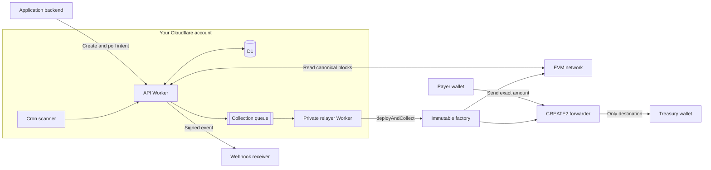
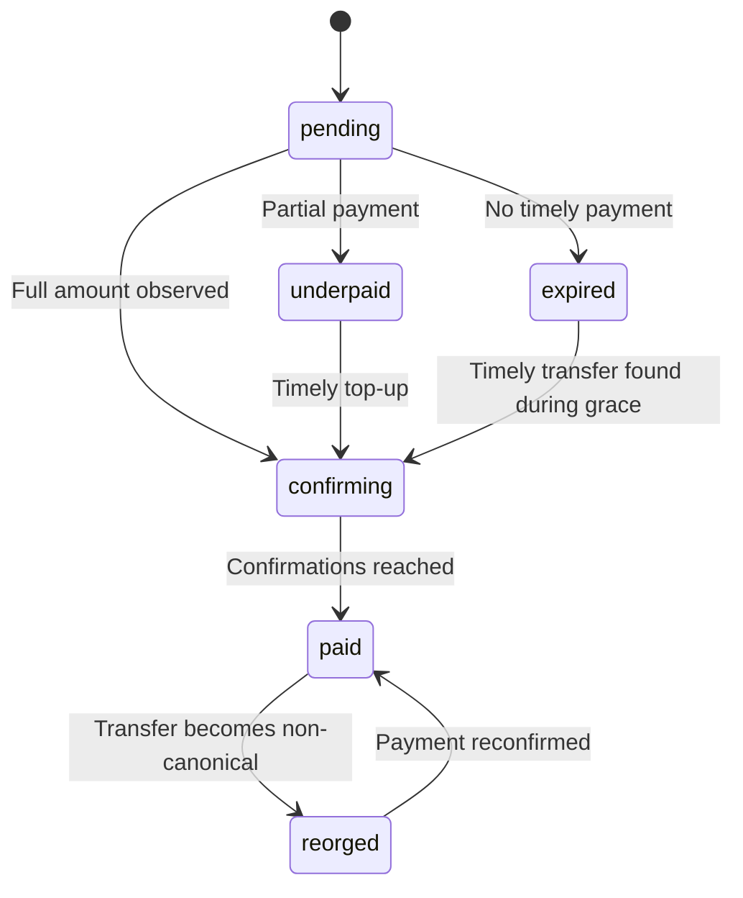

<div align="center">

# EVM Payment Gateway

**Serverless CREATE2 crypto payments in your own Cloudflare account.**

Create exact payment intents with deterministic keyless addresses, confirm EVM
transfers, send signed webhooks, and collect funds in your treasury without
operating servers or managing deposit keys.

[Quick start](#quick-start) · [How it works](#how-it-works) · [API](#api) ·
[Demo](#demo) · [Security](#security) · [Integration guide](INTEGRATION.md)


[](LICENSE)

</div>

> [!IMPORTANT]
> The gateway detects and collects payments. Your application remains
> responsible for orders, credits, subscriptions, donations, refunds, and every
> other form of fulfillment. Recurring payments require a new manual invoice;
> the gateway never withdraws from a payer's wallet.

> [!WARNING]
> The contracts have extensive automated tests but no external audit. Use
> testnets first. Mainnet deployment requires an explicit
> `ALLOW_UNAUDITED_MAINNET=true` acknowledgement.

## Features

| Capability | Behavior |
| --- | --- |
| Exact checkout | Unique CREATE2 address, decimal amount, EIP-681 wallet link, and SVG QR code per intent. |
| Payment state | Polling, expiry, partial payments, remaining-amount top-ups, confirmations, overpayments, and transaction history. |
| Reorg recovery | Canonical block tracking reverses orphaned payments and treasury-collection accounting before retrying. |
| Treasury collection | Immutable CREATE2 forwarders route native tokens and ERC-20 balances to one configured treasury. |
| Signed events | HMAC-SHA256 webhooks retry with stable event IDs for idempotent application handling. |
| Serverless deployment | Cloudflare Workers, D1, Queues, Cron Triggers, and service bindings; no VM or container. |
| Analytics | Exact integer totals for requested, received, confirmed, collected, fees, statuses, and webhooks. |

## Supported networks

Networks and assets are configuration, not hard-coded product behavior.

| Network | Mainnet | Testnet | Native | Included token examples |
| --- | --- | --- | --- | --- |
| Ethereum | Ethereum | Sepolia | ETH | USDC, USDT |
| Base | Base | Base Sepolia | ETH | USDC |
| BNB Chain | BNB Chain | BNB Testnet | BNB / TBNB | USDT on mainnet |

Verify every production token address and decimal count with its issuer.

## How it works



1. The API generates a random salt and calculates the CREATE2 address committed
   to the factory, treasury, and asset. No private key exists for this address.
2. The payer sends the exact amount to that address. Funds accumulate there
   until the configured confirmation count is reached.
3. The relayer pays gas to call `deployAndCollect`. The factory deploys the
   immutable forwarder at the predicted address and collects its full balance.
4. Native payments sent after deployment forward immediately. Later ERC-20
   payments are collected by another permissionless relayer call.
5. The application receives `payment.succeeded` independently of treasury
   collection, so relayer downtime never changes payment truth.

Unexpected native or ERC-20 assets can also be collected permissionlessly, but
their only possible destination remains the immutable treasury.

The payer never interacts with the factory directly and never needs extra gas
beyond the transfer itself. The deposit address never needs ETH or BNB for an
ERC-20 collection.



## Quick start

### Requirements

- Node.js 22+
- [Foundry](https://getfoundry.sh/introduction/installation/)
- A Cloudflare account with Workers, D1, Queues, and Cron Triggers
- An HTTPS EVM RPC endpoint
- A treasury address and a separate low-balance relayer account

### Deploy to testnet

```bash
git clone https://github.com/ifokeev/evm-payment-gateway.git
cd evm-payment-gateway
npm ci
cp .api.secrets.example .api.testnet.secrets
cp .sweeper.secrets.example .sweeper.testnet.secrets
npx wrangler login
```

Deploy the stateless factory once on each enabled chain:

```bash
FACTORY_RPC_URL="https://your-testnet-rpc.example" \
FACTORY_DEPLOYER_PRIVATE_KEY="0x..." \
npm run deploy:factory -- testnet 84532
```

The command runs the contract suite, deploys the factory, and prints its address
and runtime code hash. Put both values into the API and relayer network JSON.
The deployer has no special contract permissions after deployment.

Generate a separate relayer key with `cast wallet new`. Put its public address
in both network configurations, put its private key only in
`.sweeper.testnet.secrets`, and fund it with a small amount of testnet native
token. Then replace every placeholder and deploy:

```bash
npm run deploy -- testnet
```

Wrangler uses isolated resource names for the two environments:

| Resource | Testnet | Mainnet |
| --- | --- | --- |
| API Worker | `evm-payment-gateway-api-testnet` | `evm-payment-gateway-api-mainnet` |
| Relayer Worker | `evm-payment-gateway-sweeper-testnet` | `evm-payment-gateway-sweeper-mainnet` |
| D1 database | `evm-payment-gateway-testnet` | `evm-payment-gateway-mainnet` |
| Queue | `evm-payment-gateway-sweeps-testnet` | `evm-payment-gateway-sweeps-mainnet` |

Use separate RPC credentials, treasuries, relayer keys, API keys, and webhook
secrets for testnet and mainnet.

## Configuration

The API Worker receives payment and webhook secrets plus public network
configuration. The private relayer Worker receives only its network JSON and
relayer key; it never receives the payment API key or webhook secret.

```json
{
  "name": "base-sepolia",
  "chainId": 84532,
  "rpcUrl": "https://your-rpc.example",
  "treasuryAddress": "0xYourTreasury",
  "factoryAddress": "0xDeployedFactory",
  "factoryCodeHash": "0xRuntimeCodeHash",
  "relayerAddress": "0xLowBalanceRelayer",
  "confirmations": 3,
  "maxGasPriceWei": "5000000000",
  "nativeAsset": "ETH",
  "explorerUrl": "https://sepolia.basescan.org",
  "tokens": {
    "USDC": {
      "address": "0x036CbD53842c5426634e7929541eC2318f3dCF7e",
      "decimals": 6
    }
  }
}
```

Copy only the networks you enable from
[`networks.example.json`](networks.example.json). The
`SWEEPER_NETWORKS_JSON` copy adds `relayerPrivateKey`; the API rejects that
field. All URLs must use HTTPS, all configured addresses must be distinct, and
the private key must match `relayerAddress`.

| Setting | Purpose |
| --- | --- |
| `DEFAULT_EXPIRY_SECONDS` | Default checkout lifetime. |
| `MAX_EXPIRY_SECONDS` | Maximum caller-selected lifetime. |
| `PAYMENT_GRACE_SECONDS` | Time after expiry in which a mined transfer still qualifies. |
| `REORG_HISTORY_BLOCKS` | Canonical block window retained for reorg recovery. |
| `SWEEPER_MIN_TOKEN_PAYMENT_BPS` | Minimum expired token underpayment worth collecting. |
| `SWEEPER_GAS_BUFFER_BPS` | Buffer applied to estimated collection gas. |
| `SWEEPER_RETRY_SECONDS` | Delay before retrying collection. |

## API

All payment routes use `/api/payments/v1`. Only `GET /health` is public; every
other route requires the server-side bearer key.

```bash
curl -X POST "$GATEWAY_URL/api/payments/v1/intents" \
  -H "Authorization: Bearer $PAYMENT_API_KEY" \
  -H "Idempotency-Key: payment-attempt-001" \
  -H "Content-Type: application/json" \
  -d '{
    "kind": "payment",
    "externalId": "order-001",
    "chain": "base-sepolia",
    "asset": "USDC",
    "amount": "10.25",
    "expiresInSeconds": 1800,
    "metadata": { "accountId": "account-001" }
  }'
```

`kind` is the generic settlement behavior: `payment` for a charge and `invoice`
for a payable invoice. Donations, account deposits, purchases, and subscription
periods remain application concepts stored in `externalId` or metadata.

| Method | Route | Purpose |
| --- | --- | --- |
| `POST` | `/intents` | Create or idempotently replay an intent. |
| `GET` | `/intents/{id}` | Poll state and included transactions. |
| `GET` | `/intents/{id}/transactions` | Read payment transaction history. |
| `GET` | `/intents/{id}/sweep` | Read treasury-collection history. |
| `GET` | `/analytics/summary` | Read exact aggregate payment and collection metrics. |
| `GET` | `/health` | Read scanner progress by network. |

Successful payments emit `payment.succeeded`; an orphaned success emits
`payment.reorged`. Expired underpayments that are later collected emit the
informational `payment.recovered` event but never become paid. See the
[application integration guide](INTEGRATION.md) for webhook verification,
idempotent fulfillment, partial payments, recurring invoices, and examples.

## Demo

The optional demo Worker shows a real testnet checkout, polling, signed webhook
receipt, and treasury collection. A private service binding keeps the API key
out of browser code.

```bash
cp .demo.secrets.example .demo.secrets
npm run deploy:demo
```

Create a Turnstile widget for the demo hostname, fill the secrets file, and set
the API Worker's webhook URL to the demo's `/webhooks/payment` endpoint. Dummy
Turnstile keys are for local and automated tests only.

## Security

- `PaymentForwarder` has no owner, proxy, upgrade path, arbitrary destination,
  `delegatecall`, or `selfdestruct`. Treasury and asset are immutable.
- The API and relayer verify the configured factory's runtime code hash before
  calculating addresses or signing collection transactions.
- The treasury key never enters Cloudflare. Prefer a multisig treasury for real
  funds.
- The relayer key can spend only its own native balance. It cannot sign for a
  deposit address or redirect a forwarder, so keep its balance deliberately low.
- The API rejects relayer private keys and independently validates registered
  collection transactions. The relayer Worker never receives payment or webhook
  credentials.
- Webhooks sign the exact body and timestamp, never follow redirects, and retry
  with stable event IDs.
- Token configuration is an allowlist. Never enable an untrusted token contract.

Read [`SECURITY.md`](SECURITY.md) before production use. This design reduces the
impact of a compromised Worker but does not make unaudited code risk-free.

## Development

```bash
npm ci
npm run check
```

`npm run check` runs Solidity formatting, unit/fuzz/invariant tests, generated
bytecode verification, Biome, TypeScript, Worker/D1 tests, and Wrangler dry-run
builds. The pre-commit hook runs the same contract checks plus staged linting.

| Command | Purpose |
| --- | --- |
| `npm run contracts:check` | Verify Solidity formatting, tests, invariants, and generated bytecode. |
| `npm run dev` | Start the API Worker locally. |
| `npm run dev:demo` | Start the demo Worker locally. |
| `npm run format` | Format supported files with Biome. |
| `npm run lint` | Lint the codebase with Biome. |
| `npm test` | Run Worker and D1 tests. |
| `npm run deploy:dry-run` | Build every Worker environment without deploying. |
| `npm run deploy -- testnet` | Deploy the isolated testnet stack. |
| `npm run deploy:factory -- testnet 84532` | Test and deploy the factory on Base Sepolia. |

Before mainnet, complete testnet payments for every enabled native/token pair,
verify treasury receipt and signed webhooks, exercise RPC failure recovery, and
review every configured address. Mainnet commands require
`ALLOW_UNAUDITED_MAINNET=true`.

## Contributing

Issues and pull requests are welcome. Keep changes focused, add a regression
test for payment or security behavior, and run `npm run check`. Report
vulnerabilities through GitHub private vulnerability reporting.

## License

Released under the [MIT License](LICENSE).
