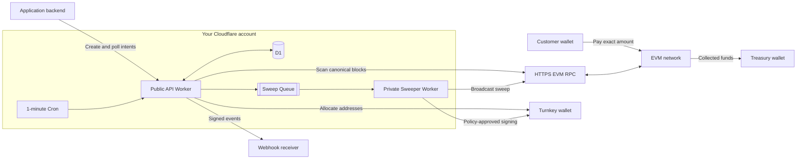
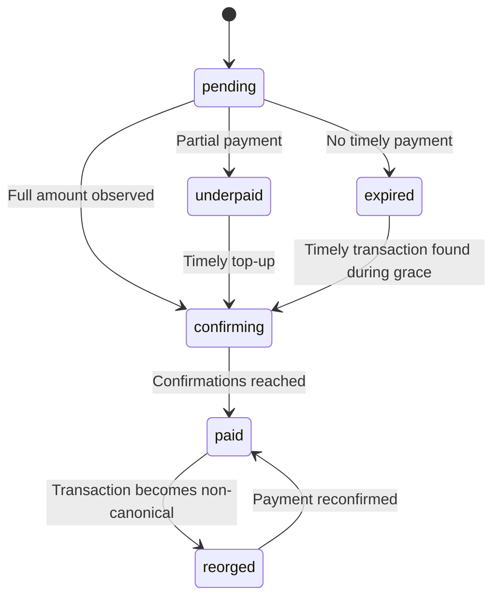

<div align="center">

# EVM Payment Gateway

**Serverless crypto payments you deploy in your own Cloudflare account.**

Create exact payment intents, confirm EVM transfers, deliver signed webhooks,
and sweep funds into your treasury—without operating servers.

[Quick start](#quick-start) · [Demo](#demo) · [How it works](#how-it-works) · [API](#api) ·
[Security](#security) · [Integration guide](INTEGRATION.md)


[](LICENSE)

</div>

> [!IMPORTANT]
> The gateway detects and collects payments. Your application decides what each
> intent represents and remains responsible for fulfillment. The gateway never
> performs automatic wallet withdrawals.

## Why this gateway

| | |
| --- | --- |
| **No server operations** | Two Cloudflare Workers, D1, Queues, and Cron replace VMs, containers, and polling daemons. |
| **Exact checkout** | Every intent receives a unique address, exact decimal amount, EIP-681 deep link, and SVG QR code. |
| **Reliable settlement** | Confirmation tracking, expiry, partial payments, top-up QR codes, reorg recovery, and transaction history are built in. |
| **Treasury collection** | Native and ERC-20 balances sweep automatically; token wallets receive only the gas they need. |
| **Policy-limited custody** | Turnkey holds the deposit wallet and signs only transactions allowed by your policies. Deposit keys never enter Cloudflare. |
| **Application-safe events** | HMAC-signed, retryable webhooks use stable event IDs for idempotent fulfillment. |

## Supported networks

Networks and tokens are configuration, not hard-coded branches. The included
presets cover:

| Network | Production | Testnet | Native asset | Example tokens |
| --- | --- | --- | --- | --- |
| Ethereum | Mainnet | Sepolia | ETH | USDC, USDT |
| Base | Mainnet | Sepolia | ETH | USDC |
| BNB Chain | Mainnet | BNB Testnet | BNB / TBNB | USDT on mainnet |

Always verify mainnet token contracts with their issuers before accepting
payments.

## How it works



1. Your backend creates a generic `payment` or `invoice` intent. Product details
   stay in your application and optional metadata.
2. The API returns a unique deposit address, exact amount, QR code, and wallet
   deep link.
3. Cron scans canonical blocks and tracks `pending`, `underpaid`, `confirming`,
   `paid`, `expired`, and `reorged` states.
4. A confirmed payment emits `payment.succeeded`; a later chain reorg emits
   `payment.reorged`.
5. The private Worker sweeps the complete recoverable balance to your configured
   treasury.



Native deposits pay their own sweep fee. USDC and USDT deposit addresses receive
only the missing ETH or BNB from a deliberately low-balance gas wallet before
their complete token balance is swept. Gas funding is capped cumulatively per
sweep job.

## Quick start

### Requirements

- Node.js 22 or newer
- A Cloudflare account with Workers, D1, Queues, and Cron enabled
- An HTTPS RPC endpoint for each EVM network
- A Turnkey organization with one dedicated HD wallet
- A treasury address; use a Safe or another multisig for production

### Deploy

```bash
git clone https://github.com/ifokeev/evm-payment-gateway.git
cd evm-payment-gateway
npm ci
cp .api.secrets.example .api.secrets
cp .sweeper.secrets.example .sweeper.secrets
npx wrangler login
npm run deploy
```

Before running the last command:

1. Create separate non-root Turnkey credentials for the API address allocator
   and transaction signer.
2. Install and specialize the policies in
   [`turnkey/policies.example.json`](turnkey/policies.example.json).
3. Configure networks and secrets in the two local secrets files. Never commit
   them.

`npm run deploy` provisions and deploys the public API Worker, applies D1
migrations, and deploys the isolated queue consumer. Re-run it to upgrade the
same installation.

> [!WARNING]
> Start on Base Sepolia with disposable credentials and test funds. Review the
> [security model](#security) before enabling any mainnet network.

## Demo

The optional demo Worker provides a real testnet checkout, user-chosen account
top-ups, payment polling, webhook delivery, and treasury sweep status. It uses a
private [service binding](https://developers.cloudflare.com/workers/runtime-apis/bindings/service-bindings/),
so the gateway API key never reaches the browser.

```bash
cp .demo.secrets.example .demo.secrets
npm run deploy:demo
```

Before deploying it:

1. Create a Turnstile widget for the demo hostname and add its site and secret
   keys to `.demo.secrets`.
2. Reuse the gateway's API key and webhook secret, then generate a separate
   random `DEMO_SESSION_SECRET` with at least 32 characters.
3. Set the API Worker's `PAYMENT_WEBHOOK_URL` to
   `https://evm-payment-gateway-demo.<your-subdomain>.workers.dev/webhooks/payment`
   and redeploy the API Worker.
4. Adjust the Base Sepolia asset and amount limits in
   [`wrangler.demo.jsonc`](wrangler.demo.jsonc) if needed.

Cloudflare creates the demo KV namespace on first deployment. Use real Turnstile
keys for any public deployment; Cloudflare's dummy keys are only for local and
automated tests.

## Configuration

The Workers intentionally receive separate secret sets:

| API Worker | Sweeper Worker |
| --- | --- |
| Payment API and webhook secrets | No payment API or webhook secrets |
| Turnkey address-allocator credential | Different Turnkey signer credential |
| Network configuration without gas keys | Matching network configuration plus low-balance gas keys for token networks |

<details>
<summary>Network configuration example</summary>

```json
{
  "name": "base-sepolia",
  "chainId": 84532,
  "rpcUrl": "https://rpc-provider.example",
  "treasuryAddress": "0xYourTreasuryAddress",
  "confirmations": 3,
  "maxGasPriceWei": "5000000000",
  "nativeAsset": "ETH",
  "explorerUrl": "https://sepolia.basescan.org",
  "tokens": {
    "USDC": {
      "address": "0x036CbD53842c5426634e7929541eC2318f3dCF7e",
      "decimals": 6
    }
  }
}
```

</details>

Copy the networks you need from [`networks.example.json`](networks.example.json),
replace every RPC URL and treasury address, remove unused networks, and minify
the result into `NETWORKS_JSON`. The matching `SWEEPER_NETWORKS_JSON` adds
`gasPrivateKey` only to networks with configured tokens.

All RPC, explorer, and webhook URLs must use HTTPS. The API configuration
rejects gas private keys, native-only networks reject unused gas keys, and a gas
wallet can never equal the treasury.

| Setting | Purpose |
| --- | --- |
| `DEFAULT_EXPIRY_SECONDS` | Default checkout lifetime. |
| `PAYMENT_GRACE_SECONDS` | Accepts transactions mined shortly after expiry. |
| `REORG_HISTORY_BLOCKS` | Canonical block window retained for reorg recovery. |
| `SWEEPER_MIN_TOKEN_PAYMENT_BPS` | Minimum expired token underpayment worth recovering. |
| `SWEEPER_MAX_GAS_FUNDING_WEI` | Cumulative gas-funding ceiling for one sweep. |
| `SWEEPER_GAS_BUFFER_BPS` | Buffer applied to estimated sweep gas. |
| `SWEEPER_RETRY_SECONDS` | Delay before retrying incomplete sweeps. |

## API

All payment routes use `/api/payments/v1`. Only `GET /health` is public; every
intent route requires the server-side bearer key.

```bash
curl -X POST "$GATEWAY_URL/api/payments/v1/intents" \
  -H "Authorization: Bearer $PAYMENT_API_KEY" \
  -H "Idempotency-Key: checkout-attempt-001" \
  -H "Content-Type: application/json" \
  -d '{
    "kind": "payment",
    "externalId": "order-001",
    "chain": "base-sepolia",
    "asset": "USDC",
    "amount": "10.25",
    "expiresInSeconds": 1800,
    "metadata": { "accountId": "account-001" }
  }'
```

The response includes the immutable invoice URI and QR plus dynamic
`remainingAmount`, `remainingUnits`, `topUpPaymentUri`, and
`topUpQrCodeDataUrl`. Top-up fields become `null` after payment or expiry.
`kind` is either `payment` for a one-time charge or `invoice` for a payable
invoice. The gateway processes both identically; product behavior stays in your
application.

| Method | Route | Purpose |
| --- | --- | --- |
| `POST` | `/intents` | Create or idempotently replay an intent. |
| `GET` | `/intents/{id}` | Poll state and included transactions. |
| `GET` | `/intents/{id}/transactions` | Inspect payment transaction history. |
| `GET` | `/intents/{id}/sweep` | Inspect treasury collection history. |
| `GET` | `/health` | Read scanner progress by network. |

See [Application integration](INTEGRATION.md) for the complete request and
response contract, webhook verification code, polling guidance, idempotent
fulfillment, partial payments, reorgs, and monthly invoices.

## Security

This gateway moves real funds. Its primary boundaries are credential isolation
and restrictive Turnkey policies:

- Turnkey generates and retains the deposit wallet. Never export its seed into
  Cloudflare.
- The API credential can allocate accounts but cannot sign. The sweeper
  credential can request only policy-approved EVM transactions.
- The API independently decodes every signed raw transaction and validates its
  signer, chain, destination, calldata, value, gas, and gas price before storage
  or broadcast.
- Treasury keys and Safe owner keys never enter either Worker.
- Each chain uses a separate, deliberately low-balance gas wallet. A compromised
  sweeper can drain that wallet, so monitor and fund it conservatively.
- Webhooks use HMAC-SHA256 over the exact body and timestamp, never follow
  redirects, and retry with stable event IDs.

Keep Turnkey recovery material and credential backups in an access-restricted
vault such as 1Password. Do not fetch an exported seed from a password manager
at runtime; 1Password is an operational vault, not an EVM signer.

Read [`SECURITY.md`](SECURITY.md) before production deployment and install
destination, chain, token calldata, gas, and gas-price policies before storing
Worker credentials. Keep policy administration and wallet export behind
human-controlled root quorum.

## Development

```bash
npm ci
npm run check
```

Tests execute in Cloudflare's `workerd` runtime against a real local D1
database. `npm run check` runs Biome, TypeScript checking, the deterministic
payment and sweep suite, and dry-runs all Worker configurations.

| Command | Purpose |
| --- | --- |
| `npm run dev` | Start the API Worker locally. |
| `npm run dev:demo` | Start the optional demo Worker locally. |
| `npm run format` | Format supported files with Biome. |
| `npm run lint` | Lint the codebase with Biome. |
| `npm run quality` | Check formatting, imports, and lint rules. |
| `npm test` | Run the Worker and D1 tests. |
| `npm run typecheck` | Check TypeScript without emitting files. |
| `npm run deploy:dry-run` | Build all Workers without deploying. |
| `npm run check` | Run every required verification. |
| `npm run deploy` | Deploy or upgrade both Workers. |
| `npm run deploy:demo` | Deploy the optional public demo. |

For a live end-to-end test, start with a small Base Sepolia native payment, then
repeat with USDC to exercise automatic gas funding. Test reorg behavior locally;
a public testnet reorg cannot be forced safely.

## Contributing

Issues and pull requests are welcome. Keep changes focused, add a regression
test for payment or security behavior, and run `npm run check` before opening a
pull request. Report vulnerabilities through GitHub's private vulnerability
reporting instead of a public issue.

## License

Released under the [MIT License](LICENSE).
