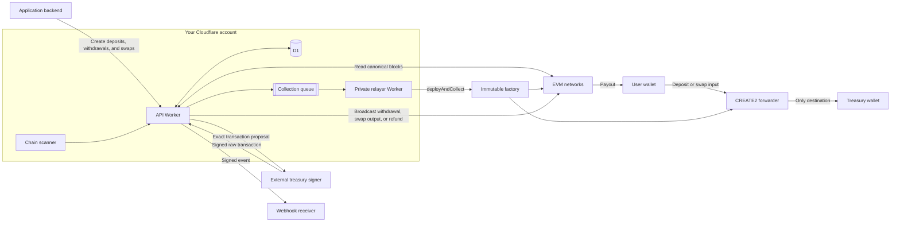
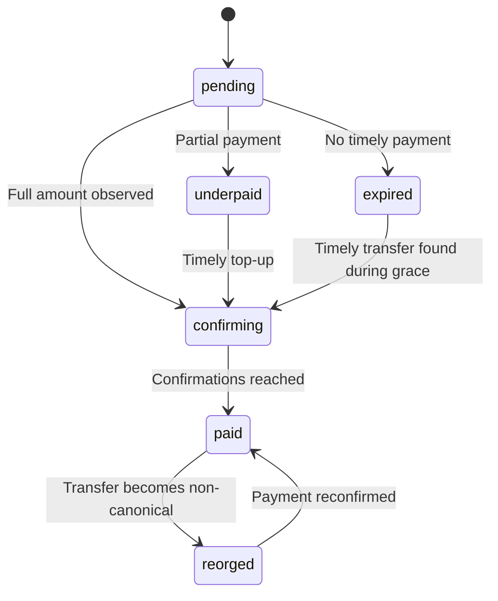

<div align="center">

# EVM Payment Gateway

**Self-hosted EVM settlement for deposits, withdrawals, and cross-chain swaps.**

The gateway creates keyless deposit addresses and collects confirmed funds in
your treasury. It prepares exact withdrawals, swap outputs, and refunds for an
external treasury signer. It also sends signed webhooks and reports settlement
analytics. The treasury key never enters Cloudflare.

[Live testnet demo](https://evm-payment-gateway-showcase-testnet.ivan-23c.workers.dev) ·
[Quick start](#quick-start) · [Architecture](#how-it-works) · [API](#api) ·
[Security](#security) · [Integration guide](INTEGRATION.md)

[](https://github.com/ifokeev/evm-payment-gateway/actions/workflows/ci.yml)


[](LICENSE)

</div>

> [!IMPORTANT]
> The gateway coordinates settlement. It does not authorize business
> operations, calculate swap prices, provide liquidity, or hold treasury keys.
> Your application remains responsible for orders, credits, subscriptions,
> donations, and fulfillment. The external signer approves treasury transfers.

> [!WARNING]
> The contracts have extensive automated tests but no external audit. Use
> testnets first. Mainnet deployment requires an explicit
> `ALLOW_UNAUDITED_MAINNET=true` acknowledgement.

## Features

| Capability | Behavior |
| --- | --- |
| Deposit intake | Unique CREATE2 address, decimal amount, EIP-681 wallet link, and SVG QR code per intent. |
| Deposit state | Polling, expiry, partial payments, remaining-amount top-ups, confirmations, overpayments, and transaction history. |
| Reorg recovery | Canonical block tracking reverses orphaned payments and treasury-collection accounting. Then the scanner retries. |
| Treasury collection | Immutable CREATE2 forwarders route native tokens and ERC-20 balances to one configured treasury. |
| Withdrawal coordination | The API validates and broadcasts exact transactions that an external treasury signer approves. |
| Swap coordination | Exact token inputs create one same-chain or cross-chain output. Failed swaps create externally signed refund proposals. |
| Signed events | HMAC-SHA256 webhooks retry with stable event IDs for idempotent application handling. |
| Serverless deployment | Cloudflare Workers, D1, Queues, Cron Triggers, and service bindings. No VM or container is necessary. |
| Analytics | Exact integer totals for requested, received, confirmed, collected, fees, statuses, and webhooks. |

## Supported networks

Networks and assets are configuration, not hard-coded product behavior.

| Network | Mainnet | Testnet | Native | Included token examples |
| --- | --- | --- | --- | --- |
| Ethereum | Ethereum | Sepolia | ETH | USDC, USDT |
| Base | Base | Base Sepolia | ETH | USDC |
| BNB Chain | BNB Chain | BNB Testnet | BNB / TBNB | Binance-Peg BSC-USD on mainnet |

Validate every production token address and decimal count against issuer data.
The included BNB token example has contract symbol `USDT`, but it is the
18-decimal Binance-Peg BSC-USD token rather than issuer-native Tether USDt.

## How it works


```mermaid
flowchart LR
    App["Application backend"]
    User["User wallet"]
    Signer["External treasury signer"]
    Webhook["Webhook receiver"]
    Chain["EVM networks"]
    Factory["Immutable factory"]
    Forwarder["CREATE2 forwarder"]
    Treasury["Treasury wallet"]

    subgraph CF["Your Cloudflare account"]
        API["API Worker"]
        DB[(D1)]
        Scanner["Chain scanner"]
        Queue[[Collection queue]]
        Relayer["Private relayer Worker"]
    end

    App -->|"Create deposits, withdrawals, and swaps"| API
    API <--> DB
    API -->|"Signed event"| Webhook
    Scanner --> API
    API <-->|"Read canonical blocks"| Chain
    User -->|"Deposit or swap input"| Forwarder
    API --> Queue --> Relayer
    Relayer -->|"deployAndCollect"| Factory
    Factory --> Forwarder
    Forwarder -->|"Only destination"| Treasury
    Factory --> Chain
    API -->|"Exact transaction proposal"| Signer
    Signer -->|"Signed raw transaction"| API
    API -->|"Broadcast withdrawal, swap output, or refund"| Chain
    Chain -->|"Payout"| User
```

The API Worker coordinates every flow and stores its state in D1. The chain
scanner updates deposits, withdrawals, swaps, and reorganization history.

Deposit collection uses a separate low-balance relayer. Withdrawal and swap
transactions use the configured payout wallet and an external signer.

The gateway does not calculate market prices or provide liquidity. The
application sets exact swap amounts. The payout wallet supplies output assets.

### Deposit collection

1. The API generates a random salt and calculates the CREATE2 address committed
   to the factory, treasury, and asset. No private key exists for this address.
2. The payer sends the exact amount to that address. Funds accumulate there
   until the configured confirmation count is reached.
3. The relayer pays gas to call `deployAndCollect`. The factory deploys the
   immutable forwarder at the predicted address and collects its full balance.
4. Native payments sent after deployment forward immediately. Another
   permissionless relayer call collects later ERC-20 payments.
5. The application receives `deposit.succeeded` independently of treasury
   collection, so relayer downtime never changes payment truth.

Anyone can collect unexpected native or ERC-20 assets. The immutable treasury
remains the only destination for these assets.

The payer never interacts with the factory directly and never needs extra gas
beyond the transfer itself. The deposit address never needs ETH or BNB for an
ERC-20 collection.

Send native deposits as direct wallet transactions. The scanner does not use
trace APIs, so it cannot find an internal native transfer from a contract.


```mermaid
stateDiagram-v2
    [*] --> pending
    pending --> underpaid: Partial payment
    pending --> confirming: Full amount observed
    underpaid --> confirming: Timely top-up
    pending --> expired: No timely payment
    expired --> confirming: Timely transfer found during grace
    confirming --> paid: Confirmations reached
    paid --> reorged: Transfer becomes non-canonical
    reorged --> paid: Payment reconfirmed
```

### Withdrawals, swaps, and refunds

A withdrawal request creates an exact transaction proposal. The external
signer approves that proposal and returns a signed raw transaction. The API
validates every field before broadcast.

A swap links one exact deposit input to one exact output. The input and output
can use different configured EVM chains. The output starts only after the input
reaches the treasury.

If a swap cannot finish, the coordinator creates an exact refund proposal. The
external signer finds it in the withdrawal inbox and approves it from the
configured payout wallet. Inbox rows identify the proposal as a withdrawal,
swap output, or refund. Swap rows also include the related swap and deposit IDs.

These cross-chain swaps are coordinated transfers, not atomic bridge swaps.

## Quick start

### Requirements

Install or obtain these requirements:

- Node.js 22+
- [Foundry](https://getfoundry.sh/introduction/installation/)
- A Cloudflare account with Workers, D1, Queues, and Cron Triggers
- An HTTPS EVM RPC endpoint
- A treasury address and a separate low-balance relayer account.

### Deploy to testnet

```bash
git clone https://github.com/ifokeev/evm-payment-gateway.git
cd evm-payment-gateway
npm ci
cp .api.secrets.example .api.testnet.secrets
cp .sweeper.secrets.example .sweeper.testnet.secrets
npx wrangler login
```

Deploy the stateless factory once on each enabled chain:

```bash
FACTORY_RPC_URL="https://your-testnet-rpc.example" \
FACTORY_DEPLOYER_PRIVATE_KEY="0x..." \
npm run deploy:factory -- testnet 84532
```

The command runs the contract suite and deploys the factory. It prints the
factory address and runtime code hash. The deployer has no special contract
permissions after deployment.

Add the factory address and runtime code hash to the API and relayer network
JSON.

Generate a separate relayer key with `cast wallet new`. Add its public address
to both network configurations. Add its private key only to
`.sweeper.testnet.secrets`. Fund the relayer with a small amount of testnet
native token. Replace the remaining placeholders. Then deploy the testnet
stack:

```bash
npm run deploy -- testnet
```

Wrangler uses isolated resource names for the two environments:

| Resource | Testnet | Mainnet |
| --- | --- | --- |
| API Worker | `evm-payment-gateway-api-testnet` | `evm-payment-gateway-api-mainnet` |
| Relayer Worker | `evm-payment-gateway-sweeper-testnet` | `evm-payment-gateway-sweeper-mainnet` |
| D1 database | `evm-payment-gateway-testnet` | `evm-payment-gateway-mainnet` |
| Scan queue | `evm-payment-gateway-scans-testnet` | `evm-payment-gateway-scans-mainnet` |
| Collection queue | `evm-payment-gateway-sweeps-testnet` | `evm-payment-gateway-sweeps-mainnet` |

Use separate RPC credentials, treasuries, relayer keys, API keys, and webhook
secrets for testnet and mainnet.

## Configuration

The API Worker receives payment and webhook secrets plus public network
configuration. The private relayer Worker receives only its network JSON and
relayer key. It never receives the payment API key or webhook secret.

```json
{
  "name": "base-sepolia",
  "chainId": 84532,
  "rpcUrls": ["https://your-primary-rpc.example", "https://your-fallback-rpc.example"],
  "treasuryAddress": "0xYourTreasury",
  "withdrawalSourceAddress": "0xYourPayoutWallet",
  "factoryAddress": "0xDeployedFactory",
  "factoryCodeHash": "0xRuntimeCodeHash",
  "relayerAddress": "0xLowBalanceRelayer",
  "confirmations": 3,
  "maxGasPriceWei": "5000000000",
  "nativeAsset": "ETH",
  "explorerUrl": "https://sepolia.basescan.org",
  "tokens": {
    "USDC": {
      "address": "0x036CbD53842c5426634e7929541eC2318f3dCF7e",
      "decimals": 6
    }
  }
}
```

Copy only the networks you enable from
[`networks.example.json`](networks.example.json). The
`rpcUrls` field is an ordered failover list.

Keep separate lists in the testnet and mainnet Cloudflare secrets. Do not commit
provider credentials. Copy the same list to `SWEEPER_NETWORKS_JSON`. Add
`relayerPrivateKey` only to that list. The API rejects that field.

`withdrawalSourceAddress` is optional. It defaults to `treasuryAddress`.
Configure a separate payout wallet to limit the balance that the external
signer can spend.

Use HTTPS for all URLs. Make sure that all configured addresses are distinct.
Make sure that the private key matches `relayerAddress`.

| Setting | Purpose |
| --- | --- |
| `DEFAULT_EXPIRY_SECONDS` | Default checkout lifetime. |
| `MAX_EXPIRY_SECONDS` | Maximum caller-selected lifetime. |
| `PAYMENT_GRACE_SECONDS` | Time after expiry in which a mined transfer still qualifies. |
| `REORG_HISTORY_BLOCKS` | Canonical block window retained for reorg recovery. |
| `SWEEPER_MIN_TOKEN_PAYMENT_BPS` | Minimum expired token underpayment that qualifies for collection. |
| `SWEEPER_GAS_BUFFER_BPS` | Buffer applied to estimated collection gas. |
| `SWEEPER_RETRY_SECONDS` | Delay between collection attempts. |

The minute scanner queues only chains with open payments or confirmed payments
still inside the configured reorg window. Chains with older history receive a
maintenance scan every 15 minutes. This schedule recovers late transfers and
limits operations on idle queues.

## API

All API routes use `/api/v1`. Only `GET /health` is public. Every
other route requires the server-side bearer key.

```bash
curl -X POST "$GATEWAY_URL/api/v1/deposits" \
  -H "Authorization: Bearer $PAYMENT_API_KEY" \
  -H "Idempotency-Key: payment-attempt-001" \
  -H "Content-Type: application/json" \
  -d '{
    "purpose": "deposit",
    "externalId": "order-001",
    "chain": "base-sepolia",
    "asset": "USDC",
    "amount": "10.25",
    "expiresInSeconds": 1800,
    "metadata": { "accountId": "account-001" }
  }'
```

Set `purpose` to `deposit` for a normal deposit. Use `swap` only for an input
that the swap coordinator manages. Store the business use case in `externalId`,
`metadata`, or your application database.

Direct withdrawal requests use `withdrawal`. The swap coordinator creates
`swap` and `refund` withdrawals.

| Method | Route | Purpose |
| --- | --- | --- |
| `POST` | `/deposits` | Create or idempotently replay an intent. |
| `GET` | `/deposits/{id}` | Poll state and included transactions. |
| `GET` | `/deposits/{id}/transactions` | Read deposit transfer history. |
| `GET` | `/deposits/{id}/sweep` | Read treasury-collection history. |
| `POST` | `/withdrawals` | Create or replay a withdrawal proposal. |
| `GET` | `/withdrawals?status=awaiting_signature` | List proposals for signer approval. |
| `GET` | `/withdrawals/{id}` | Read the withdrawal and transaction status. |
| `GET` | `/withdrawals/{id}/proposal` | Read the exact fields for the external signer. |
| `POST` | `/withdrawals/{id}/transaction` | Submit an externally signed raw transaction. |
| `POST` | `/swaps` | Link an exact swap deposit to a same-chain or cross-chain output. |
| `GET` | `/swaps/{id}` | Read the input and output state of a swap. |
| `GET` | `/analytics/summary` | Read exact deposit, collection, withdrawal, swap, and webhook metrics. |
| `GET` | `/health` | Read successful scan progress and stale active chains. |

Successful deposits emit `deposit.succeeded`. An orphaned success emits
`deposit.reorged`. Collected expired underpayments emit the
informational `deposit.recovered` event but never become paid. See the
[application integration guide](INTEGRATION.md) for webhook verification,
idempotent fulfillment, partial payments, recurring invoices, and examples.

## Demo

The optional demo Worker shows testnet deposits, withdrawals, and cross-chain
swaps. Swap quotes use fixed configured testnet amounts, not market prices. The
demo uses one user wallet for the swap output and possible refund. The core API
keeps these addresses separate. The demo follows signed webhooks, treasury
collection, outputs, and refunds.

The demo has a signer inbox for withdrawals, swap outputs, and refunds. It
shows exact proposals and accepts signed raw transactions. The treasury signer
stays outside Cloudflare. A private service binding keeps the API key out of
browser code.

[Open the live testnet demo](https://evm-payment-gateway-showcase-testnet.ivan-23c.workers.dev) ·
[Open the testnet signer inbox](https://evm-payment-gateway-showcase-testnet.ivan-23c.workers.dev/signer) ·
[View testnet analytics](https://evm-payment-gateway-showcase-testnet.ivan-23c.workers.dev/analytics)

```bash
cp .demo.secrets.example .demo.secrets
npm run deploy:demo
```

Create a Turnstile widget for the demo hostname. Fill the secrets file. Set the
API Worker webhook URL to the demo `/webhooks/deposit` endpoint.

Dummy Turnstile keys are for local and automated tests only.

## Security

The gateway uses these security controls:

- `PaymentForwarder` has no owner, proxy, upgrade path, arbitrary destination,
  `delegatecall`, or `selfdestruct`. Treasury and asset are immutable.
- The API and relayer validate the configured factory runtime code hash. Then
  they calculate addresses or sign collection transactions.
- The treasury key never enters Cloudflare. A multisig treasury is preferable
  for real funds.
- The withdrawal API accepts only a transaction from the configured withdrawal source.
  It validates the chain, asset, amount, destination, fee, gas, and nonce.
- An input reorg expires unsigned swap-output and refund proposals. The API
  rejects later transaction submissions for these proposals.
- The relayer key can spend only its own native balance. It cannot sign for a
  deposit address or redirect a forwarder. A low balance limits its exposure.
- The API rejects relayer private keys and independently validates registered
  collection transactions. The relayer Worker never receives payment or webhook
  credentials.
- Webhooks sign the exact body and timestamp, never follow redirects, and retry
  with stable event IDs.
- Token configuration is an allowlist. Trusted token contracts are the only
  permitted entries.

Before production use, read [`SECURITY.md`](SECURITY.md). This design reduces the
impact of a compromised Worker but does not make unaudited code risk-free.

## Development

```bash
npm ci
npm run check
```

`npm run check` runs Solidity formatting, unit/fuzz/invariant tests, generated
bytecode verification, Biome, TypeScript, Worker/D1 tests, and Wrangler dry-run
builds. The pre-commit hook runs the same contract checks plus staged linting.

| Command | Purpose |
| --- | --- |
| `npm run contracts:check` | Validate Solidity formatting, tests, invariants, and generated bytecode. |
| `npm run dev` | Start the API Worker locally. |
| `npm run dev:demo` | Start the demo Worker locally. |
| `npm run format` | Format supported files with Biome. |
| `npm run lint` | Lint the codebase with Biome. |
| `npm test` | Run Worker and D1 tests. |
| `npm run deploy:dry-run` | Build every Worker environment. Do not deploy. |
| `npm run deploy -- testnet` | Deploy the isolated testnet stack. |
| `npm run deploy:factory -- testnet 84532` | Test and deploy the factory on Base Sepolia. |

Before mainnet, complete a testnet payment for each enabled native or token
pair. Validate the treasury receipt and signed webhook for each payment.
Exercise RPC failure recovery. Review every configured address. Mainnet
commands require `ALLOW_UNAUDITED_MAINNET=true`.

Test Base Sepolia ETH and USDC. Test Ethereum Sepolia ETH and USDC. Test BNB
Testnet TBNB.

This matrix has no issuer-native Tether test token. Fork-test the exact Ethereum
USDT and BNB BSC-USD contracts. Before you enable either token publicly, run a
minimum-value mainnet canary.

## Contributing

Issues and pull requests are welcome. Keep changes focused. Add a regression
test for payment or security behavior. Run `npm run check`. Report
vulnerabilities through GitHub private vulnerability reporting.

## License

Released under the [MIT License](LICENSE).
